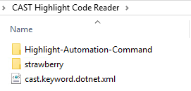
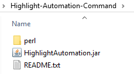

# Scan Automation after AWS Transform for .Net automatically upgraded .Net repositories

This Python script automatically scans the source code of 2 branches of git repositories transformed by AWS Transform for .Net with CAST Highlight Code Reader (before and after the transformation). 

This script takes as an input a JSON file generated by AWS Transform for .Net and a token to connect to a CAST Highlight account.
If the GitHub repositories are private, it requires also a GitHub token.
The default CAST Highlight URL is https://rpa.casthighlight.com, but you can select another one like ,https://cloud.casthighlight.com or https://app.casthighlight.com 


## ⚙️ Installation

### 0. Pre-requisites
Python 3.13.3 or higher (Python 3.09 and 3.10 not supported)
Java 11 or higher
CAST Highlight Code reader (5.9.19-RELEASE or higher).

### 1. Install CAST Highlight Code Reader CLI
1.1 Download the latest release of the CAST Highlight Code reader CLI using the following URL:  
https://doc.casthighlight.com/tools/cli/Highlight-Automation-Command.tar.gz

1.2 Unzip the file _Highlight-Automation-Command.tar.gz_ ("Extract Here" option, no subfolder required).  
➡️ It unzips the file _Highlight-Automation-Command.tar_  

1.3 Unzip the file _Highlight-Automation-Command.tar_ ("Extract Here" option, no subfolder required).  
➡️ It unzips the folder _Highlight-Automation-Command_ which contains:   
 - HighlightAutomation.jar
 - README.txt
 - _perl_ folder.

1.4 Copy the folder _Highlight-Automation-Command_ under the _CAST Highlight Code Reader_ folder which is where you have unzipped the "AWS Transform For Downstream automation" extension (the _cast.awstransform.upstreamrecommendations.1.X.0.zip_ file)  
➡️ You get the following files and folder under the _CAST Highlight Code Reader_ folder  
  
and the following files under the _Highlight-Automation-Command_ folder  


### 2. Set up the virtual environment

```bash
python -m venv venv
```
```bash
source venv/bin/activate      # macOS / Linux
venv\Scripts\activate         # Windows
```

### 3. Install the dependencies

```bash
pip install -r requirements.txt
```
##  Main steps in execution order

1. Retrieve the command line parameters
2. Set up the analysis environment by creating several folders
3. Use the CAST Highlight API and the CAST token to retrieve the company id of the CAST Highlight account
4. Read the JSON file to get the list of repositories and branches to scan
5. Process the repositories one by one
6. For each repository, an application is creating in CAST Highlight using the API
7. For each branch of a repository to scan, a .properties file is created with all the CAST Highlight settings
8. CAST Highlight code reader is launched to the 2 repository branches and upload the scan results directly in CAST Highlight  

User can check and visualize the scan results in the Highlight Dashboards
 
## 🖥️ Python Script - CLI Usage

### Help
```bash
python .\CastAutomationPost.py --help

usage: CastAutomationPost.py [-h] --json-file-path JSON_FILE_PATH [--github-token GITHUB_TOKEN] --cast-token CAST_TOKEN
                             [--cast-url {https://rpa.casthighlight.com,https://cloud.casthighlight.com,https://app.casthighlight.com,https://demo.casthighlight.com}]

Automatically launches the scans of the source code of 2 git branches from git repositories transformed by AWS Transform for .Net and listed in a JSON file.

options:
  -h, --help            show this help message and exit
  --json-file-path JSON_FILE_PATH
                        Path to the JSON file
  --github-token GITHUB_TOKEN
                        GitHub token
  --cast-token CAST_TOKEN
                        CAST Highlight token
  --cast-url {https://rpa.casthighlight.com,https://cloud.casthighlight.com,https://app.casthighlight.com,https://demo.casthighlight.com}
                        CAST Highlight URL - optional - default is https://rpa.casthighlight.com
```

### Example - For public repositories
```bash
python .\CastAutomationPost.py --json-file-path "C:\CAST\AWSTransformDownstreamAutomation\transformation-report-1.json", --cast-token "<cast_highlight_token>"
```

### Example - For private repositories with GitHub token
```bash
python .\CastAutomationPost.py --json-file-path "C:\CAST\AWSTransformDownstreamAutomation\transformation-report-1.json", --cast-token "<cast_highlight_token>" --github-token "<github_token>"
```

### Example - With a different CAST Highlight URL
```bash
python .\CastAutomationPost.py --json-file-path "C:\CAST\AWSTransformDownstreamAutomation\transformation-report-1.json", --cast-token "<cast_highlight_token>" --github-token "<github_token>" --cast-url https://demo.casthighlight.com
```

### Test/Practice Environment
GitHub ID:            https://github.com/ReposForDemos

Transformed Branch:   _transform-d6a7e41f_

| Public Repositories with the transformed branch | Initial Branch |  
|-------------------------------------------------|----------------|  
| bobs-used-bookstore-classic                     | main           |  
| BSTTiming                                       | main           |
| Scrutor                                         | master         |
| JabbR                                           | master         |
| Umbraco-CMS                                     | contrib        |

JSON file for tests:  transformation-report-test.json

### Author
Created by fcnico98 (n.bidaux@castsoftware.com) and Rakshith Ravi Kumar (rakskuma@amazon.com) 
